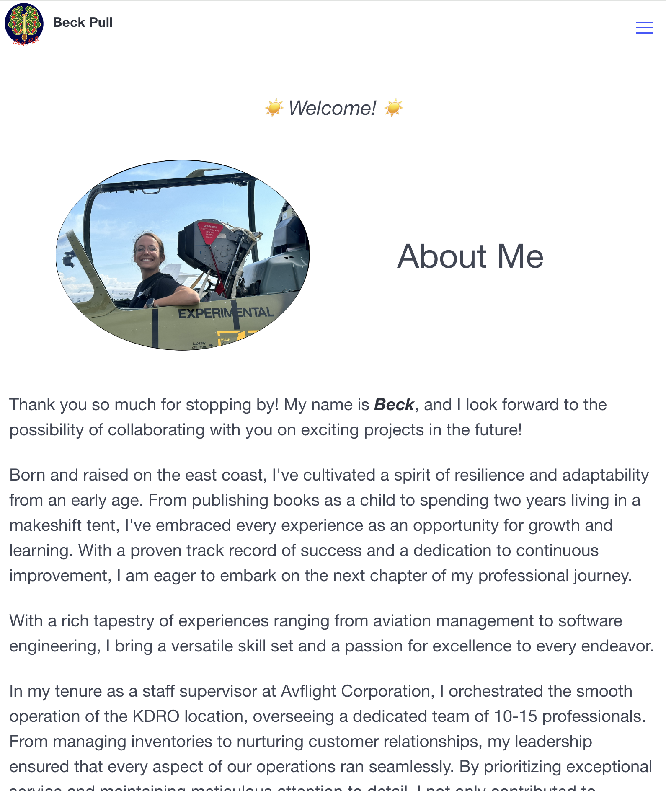
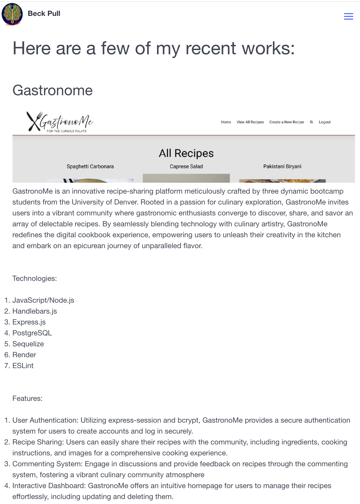
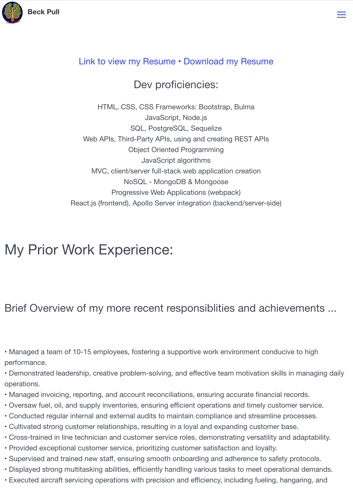
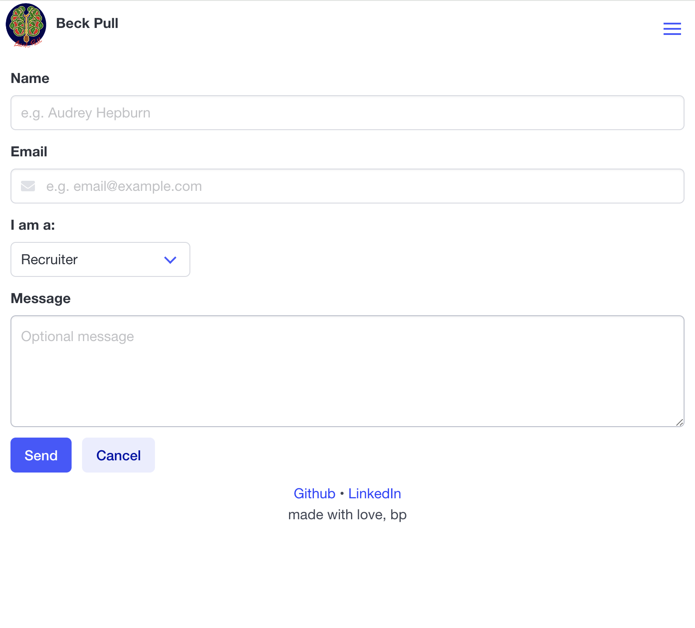
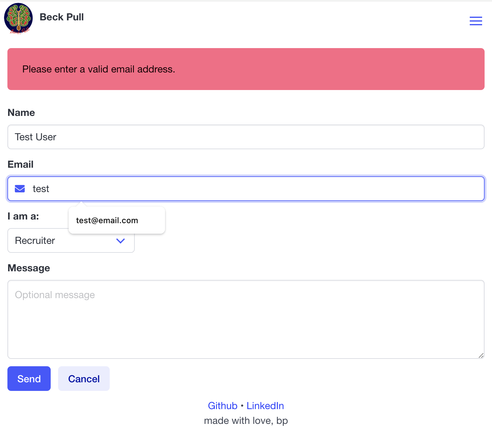
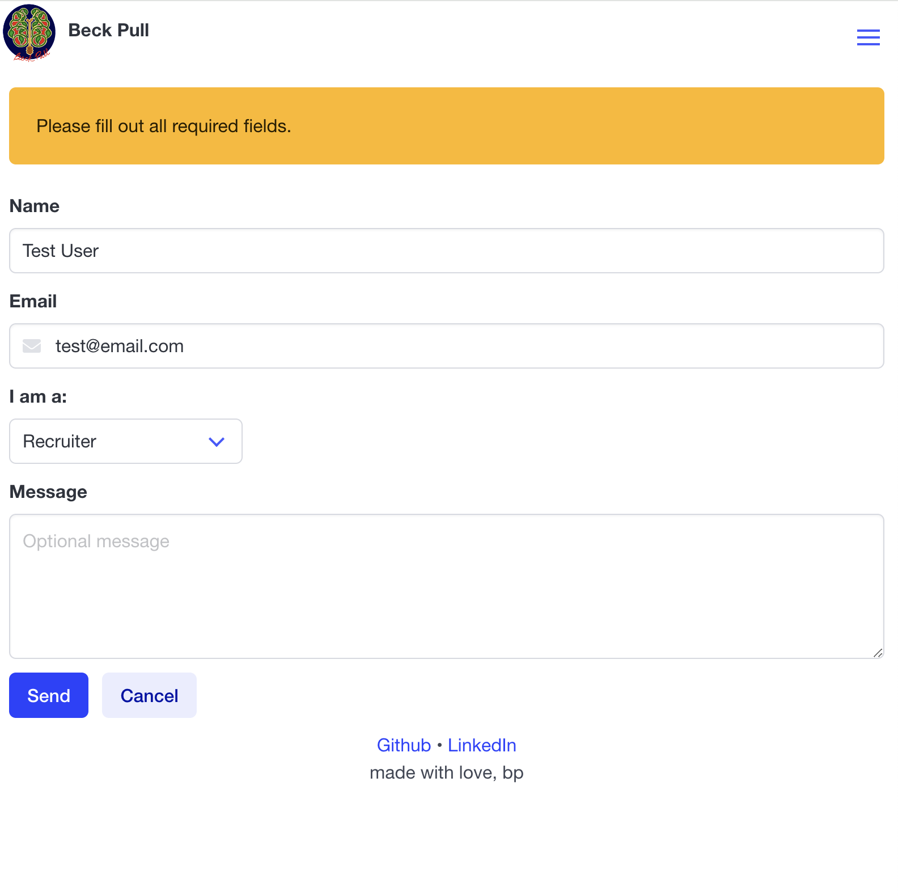
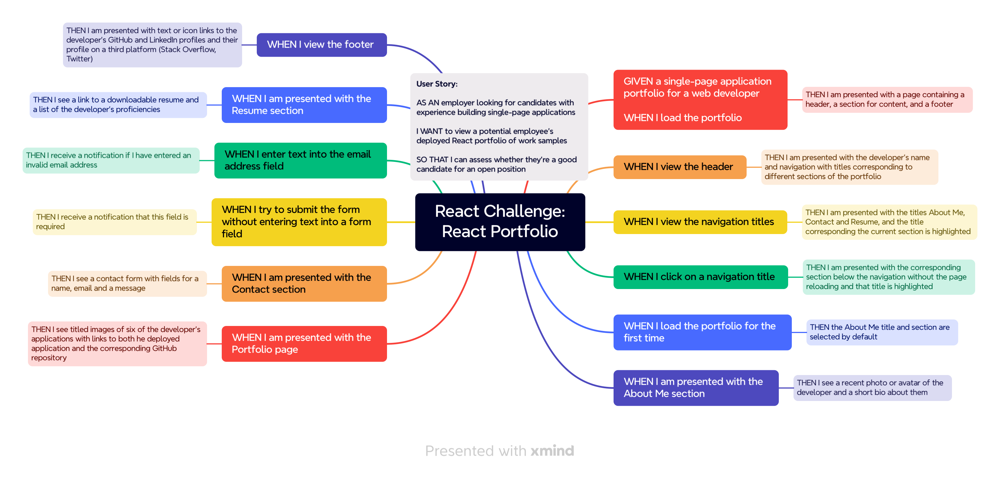

<a name="readme-top"></a>

[![Contributors][contributors-shield]][contributors-url]
[![Forks][forks-shield]][forks-url]
[![Stargazers][stars-shield]][stars-url]
[![Issues][issues-shield]][issues-url]
[![MIT License][license-shield]][license-url]
[![LinkedIn][linkedin-shield]][linkedin-url]
</br>

<br />
<div align="center">
  <a href="https://github.com/beckpull/portfolio">

<h1 align="center">My Portfolio</h1>

  <p align="center">React Portfolio Repository—A comprehensive showcase of my work, skills, and achievements. Harnessing the capabilities of React to create an engaging and professional online presence.
    <br />
    <a href="https://github.com/beckpull/portfolio"><strong>Explore the docs »</strong></a>
    <br />
    <br />
    <a href="https://www.beckpull.com">View Webpage</a>
    ·
    <a href="https://github.com/beckpull/portfolio/issues">Report Bug</a>
    ·
    <a href="https://github.com/beckpull/portfolio/issues">Request Feature</a>
  </p>
</div>

</br>
</br>

<!-- TABLE OF CONTENTS -->
<details>
  <summary>Table of Contents</summary>
  <ol>
    <li>
      <a href="#about-the-project">About The Project</a>
      <ul>
        <li><a href="#built-with">Built With</a></li>
      </ul>
    </li>
    <li>
      <a href="#getting-started">Getting Started</a>
      <ul>
        <li><a href="#prerequisites">Prerequisites</a></li>
        <li><a href="#installation">Installation</a></li>
      </ul>
    </li>
    <li><a href="#usage">Usage</a></li>
    <li><a href="#roadmap">Roadmap</a></li>
    <li><a href="#contributing">Contributing</a></li>
    <li><a href="#license">License</a></li>
    <li><a href="#contact">Contact</a></li>
     <li><a href="#acknowledgments">Acknowledgments</a></li>
  </ol>
</details>

</br>
</br>

<!-- ABOUT THE PROJECT -->

## About The Project

### Overview:

This React Portfolio project is a comprehensive showcase of my work, skills, and achievements, crafted with the latest web technologies. It provides a professional online presence for users to explore my portfolio and learn more about my capabilities.

### Key Features:

- **Responsive Design**: Ensures optimal viewing experience across various devices and screen sizes.
- **Interactive Interface**: Engages users with intuitive navigation and interactive elements.
- **Project Showcase**: Highlights my projects, including descriptions, technologies used, and links to live demos or repositories.
- **Skills Section**: Showcases my technical skills and proficiencies relevant to web development.
- **About Me Page**: Provides insight into my background, experience, and interests.
- **Contact Form**: Enables visitors to reach out to me directly for inquiries or collaborations.

### Technologies Used:

- **Frontend**: React.js, HTML, CSS
- **Backend**: MongoDB, Mongoose, Apollo Server (in progress)
- **Deployment**: Netlify

### Goals:

The primary goal of the React Portfolio project is to create a professional and visually appealing platform to showcase my work and skills to potential employers, clients, and collaborators. It aims to demonstrate my proficiency in web development while providing an interactive and informative experience for visitors.

<p align="right">(<a href="#readme-top">back to top</a>)</p>

### Built With

- 
- 
- ![NodeJS]
- 
- 
- 
- 
- 
- 
- 
- 
- 
- 

<p align="right">(<a href="#readme-top">back to top</a>)</p>

<!-- GETTING STARTED -->
<!-- ## Getting Started -->

<!-- ### Prerequisites

_This application has several dependencies, to install individually onto your machine, navigate to the directory this code lives in and type these commands into your Terminal / Git Bash:_ -->

<!-- ```sh
#   npm i express
#   npm i mongodb
#   npm i mongoose
#   npm i nodemon --save-dev
``` -->

<!-- ### Installation

_To get a local copy up and running follow these simple example steps:_

1. Clone the repo
   ```sh
   HTTP: git clone https://github.com/beckpull/portfolio.git
   SSH: git clone git@github.com:beckpull/portfolio.git
   ```
2. Install all necessary NPM packages
   ```sh
   npm i && npm run start:dev
   ``` -->
<!-- 3. Node `server.js`
   ```sh
   npm start
   ``` -->

<!-- <p align="right">(<a href="#readme-top">back to top</a>)</p> -->

<!-- USAGE EXAMPLES -->

## Usage

</br></br>

<p align="center"><i><strong>✨ Everything you need to know ✨</strong></i></p>

<div align="center"> 
  
  </br>
  </br>
  <strong><i>Scan the QR code above or click <strong><a href="https://www.beckpull.com">HERE</a></strong> to view this deployed site on Netlify!</strong>
    </br>
    </br>
    </br>
    <a href="https://beckpull.com">
    <p>My About Me, Resumé, Projects pages</p>
      
      
      
    </a>
    </br></br>
    <a href="https://beckpull.com">
      <p>My Contact Form page functionality</p>
      
      
      
    </a>
    </br></br>
  </br></br>
</div>

<p align="right">(<a href="#readme-top">back to top</a>)</p>

<!-- ROADMAP -->

## Roadmap


<div align="right">
  <p><i>This was my roadmap for this project</i></p>
</div>
</br>

<!-- AS AN employer looking for candidates with experience building single-page applications
I WANT to view a potential employee's deployed React portfolio of work samples
SO THAT I can assess whether they're a good candidate for an open position -->

<!-- GIVEN a single-page application portfolio for a web developer
WHEN I load the portfolio
THEN I am presented with a page containing a header, a section for content, and a footer
WHEN I view the header
THEN I am presented with the developer's name and navigation with titles corresponding to different sections of the portfolio
WHEN I view the navigation titles
THEN I am presented with the titles About Me, Portfolio, Contact, and Resume, and the title corresponding to the current section is highlighted
WHEN I click on a navigation title
THEN I am presented with the corresponding section below the navigation without the page reloading and that title is highlighted
WHEN I load the portfolio the first time
THEN the About Me title and section are selected by default
WHEN I am presented with the About Me section
THEN I see a recent photo or avatar of the developer and a short bio about them
WHEN I am presented with the Portfolio section
THEN I see titled images of six of the developer’s applications with links to both the deployed applications and the corresponding GitHub repository
WHEN I am presented with the Contact section
THEN I see a contact form with fields for a name, an email address, and a message
WHEN I move my cursor out of one of the form fields without entering text
THEN I receive a notification that this field is required
WHEN I enter text into the email address field
THEN I receive a notification if I have entered an invalid email address
WHEN I am presented with the Resume section
THEN I see a link to a downloadable resume and a list of the developer’s proficiencies
WHEN I view the footer
THEN I am presented with text or icon links to the developer’s GitHub and LinkedIn profiles, and their profile on a third platform (Stack Overflow, Twitter)  -->

<p align="right">(<a href="#readme-top">back to top</a>)</p>

<!-- CONTRIBUTING -->

## Contributing

Contributions are what make the open source community such an amazing place to learn, inspire, and create. Any contributions you make are **greatly appreciated**!

_If you have a suggestion that would make this better, please fork the repo and create a pull request. You can also simply open an issue with the tag "enhancement".
Don't forget to give the project a star! Thanks again!_

1. Fork the Project
2. Create your Feature Branch (`git checkout -b feature/NewFeature`)
3. Commit your Changes (`git commit -m 'Added ______ , NewFeature'`)
4. Push to the Branch (`git push origin feature/NewFeature`)
5. Open a Pull Request

See the [open issues](https://github.com/beckpull/portfolio/issues) for a full list of proposed features (and known issues).

<p align="right">(<a href="#readme-top">back to top</a>)</p>

<!-- LICENSE -->

## License

<p align='center'>Distributed under the MIT License. See `LICENSE.txt` for more information.</p>
<p align='center'>© Beck Feltman · All rights reserved.</p>

<p align="right">(<a href="#readme-top">back to top</a>)</p>

<!-- CONTACT -->

## Contact

**Rebecca Feltman** - [Email me](mailto:beckpull@icloud.com) - or check me out on [GitHub](https://github.com/beckpull) or [LinkedIn!](https://linkedin/in/beckpull)

> Repository Link: [https://github.com/beckpull/portfolio](https://github.com/beckpull/portfolio)

<p align="right">(<a href="#readme-top">back to top</a>)</p>

<!-- ACKNOWLEDGMENTS -->

## Acknowledgments

- This README file template was created by [@othneildrew](https://github.com/othneildrew) - the original can be found [here](https://github.com/othneildrew/Best-README-Template)

#### Disclaimer:

> I utilized several articles from sources such as (but not limited to) Stack Overflow, W3Schools, and MDN Web Docs, as well as many classwork example code from the University of Denver **as references** for the javascript code attached.
>
> **All of the utilized information has been altered in order to fit this project. This repository contains _solely_ my own work.**

<p align="right">(<a href="#readme-top">back to top</a>)</p>

<!-- MARKDOWN LINKS & IMAGES -->
<!-- https://www.markdownguide.org/basic-syntax/#reference-style-links -->

[contributors-shield]: https://img.shields.io/github/contributors/beckpull/portfolio.svg?style=for-the-badge
[contributors-url]: https://github.com/beckpull/portfolio/graphs/contributors
[forks-shield]: https://img.shields.io/github/forks/beckpull/portfolio.svg?style=for-the-badge
[forks-url]: https://github.com/beckpull/portfolio/network/members
[stars-shield]: https://img.shields.io/github/stars/beckpull/portfolio.svg?style=for-the-badge
[stars-url]: https://github.com/beckpull/portfolio/stargazers
[issues-shield]: https://img.shields.io/github/issues/beckpull/portfolio.svg?style=for-the-badge
[issues-url]: https://github.com/beckpull/portfolio/issues
[license-shield]: https://img.shields.io/github/license/beckpull/portfolio.svg?style=for-the-badge
[license-url]: https://github.com/beckpull/portfolio/blob/main/LICENSE
[product-screenshot]: images/screenshot.png
[NodeJS]: https://img.shields.io/badge/node.js-6DA55F?style=for-the-badge&logo=node.js&logoColor=white
[Node-url]: https://nodejs.org/en
[JQuery.com]: https://img.shields.io/badge/jQuery-0769AD?style=for-the-badge&logo=jquery&logoColor=white
[JQuery-url]: https://jquery.com
[Bulma]: https://img.shields.io/badge/bulma-00D0B1?style=for-the-badge&logo=bulma&logoColor=white
[linkedin-shield]: https://img.shields.io/badge/linkedin-%230077B5.svg?style=for-the-badge&logo=linkedin&logoColor=white
[linkedin-url]: https://linkedin.com/in/beckpull/
[stackoverflow-shield]: https://img.shields.io/badge/-Stackoverflow-FE7A16?style=for-the-badge&logo=stack-overflow&logoColor=white
[jest-shield]: https://img.shields.io/badge/-jest-%23C21325?style=for-the-badge&logo=jest&logoColor=white
[inquirer-shield]: https://img.shields.io/badge/dependency-inquirer-black
[inquirer-url]: https://www.npmjs.com/package/inquirer
